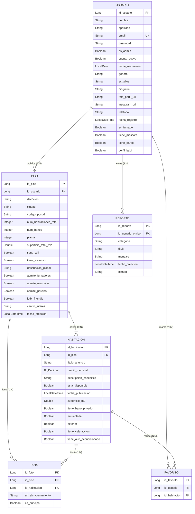

<div align="center">

# 🏠 PisoFácil
        
### Plataforma de búsqueda de habitaciones en pisos compartidos

[](https://spring.io/projects/spring-boot)
[](https://angular.dev)
[](https://www.mysql.com/)
[](https://openjdk.org/)
[](LICENSE)

*Trabajo de Fin de Grado — 2.º DAM*

</div>

---

## 📋 Índice

1. [Descripción del Proyecto](#-descripción-del-proyecto)
2. [Características Principales](#-características-principales)
3. [Stack Tecnológico](#-stack-tecnológico)
4. [Arquitectura del Sistema](#-arquitectura-del-sistema)
5. [Modelo de Datos](#-modelo-de-datos)
6. [Estructura del Proyecto](#-estructura-del-proyecto)
7. [Endpoints de la API REST](#-endpoints-de-la-api-rest)
8. [Pantallas del Frontend](#-pantallas-del-frontend)
9. [Instalación y Ejecución](#-instalación-y-ejecución)
10. [Usuarios de Prueba](#-usuarios-de-prueba)
11. [Licencia](#-licencia)

---

## 📖 Descripción del Proyecto

**PisoFácil** es una aplicación web fullstack diseñada para facilitar la búsqueda y publicación de habitaciones en pisos compartidos, orientada principalmente al mercado universitario y de jóvenes profesionales en España.

La plataforma permite a los propietarios publicar sus pisos con habitaciones disponibles, y a los buscadores encontrar la habitación ideal según sus preferencias de convivencia, ubicación, precio y servicios. Además incorpora un **motor de compatibilidad** que calcula el porcentaje de afinidad entre el perfil del buscador y las características del piso.

---

## ✨ Características Principales

### 👤 Gestión de Usuarios
- Registro con foto de perfil y datos personales
- Autenticación JWT con tokens de 24h
- Perfil editable (datos personales, biografía, Instagram, teléfono)
- Cambio de contraseña seguro
- Preferencias de convivencia (fumador, mascota, pareja, LGTBI)

### 🏘️ Gestión de Pisos
- Publicación de pisos con datos completos (dirección, ciudad, servicios)
- Subida múltiple de fotos con selección de foto principal (`esPrincipal`)
- Centro de interés (universidad/zona cercana)
- Políticas de convivencia configurables

### 🛏️ Gestión de Habitaciones
- Creación de anuncios de habitaciones dentro de cada piso
- Limitación automática: no se pueden crear más habitaciones que `numHabitacionesTotal`
- Control de disponibilidad (activar/desactivar anuncio)
- Características detalladas (superficie, baño privado, amueblada, exterior, climatización)

### 🔍 Búsqueda y Filtros
- Búsqueda por ciudad y centro de interés
- Filtros por precio (mínimo/máximo)
- Filtro por número de habitaciones (1-4)
- Filtros de servicios (WiFi, ascensor, mascotas, fumadores, parejas, LGTBI)
- Ordenación por precio y fecha

### 💚 Motor de Compatibilidad
- Cálculo automático del % de afinidad usuario-piso
- Compara: fumador ↔ admite_fumadores, mascota ↔ admite_mascotas, pareja ↔ admite_parejas, LGTBI ↔ lgtbi_friendly
- Retorna `null` cuando el perfil del usuario no tiene datos suficientes

### ⭐ Favoritos
- Marcar/desmarcar habitaciones como favoritas
- Página dedicada "Mis Favoritos" con listado y acceso rápido

### 📢 Sistema de Reportes
- Usuarios pueden reportar contenido inapropiado
- Categorías: Contenido inapropiado, Fraude, Spam, Otro
- Estados: PENDIENTE → REVISADO → RESUELTO / RECHAZADO
- Gestión completa desde el panel de administración

### 🛡️ Panel de Administración
- Dashboard con estadísticas (usuarios, pisos, habitaciones, reportes)
- Gráficos interactivos con Chart.js
- CRUD de usuarios (activar/desactivar cuentas, reset de contraseña)
- Gestión de pisos y habitaciones
- Gestión de reportes/denuncias

### 🌙 Modo Oscuro
- Alternancia light/dark en toda la aplicación
- Persistencia de la preferencia del usuario

---

## 🛠️ Stack Tecnológico

### Backend
| Tecnología | Versión | Uso |
|---|---|---|
| **Java** | 21 | Lenguaje principal |
| **Spring Boot** | 3.5.13 | Framework backend |
| **Spring Security** | 6.x | Autenticación y autorización |
| **Spring Data JPA** | — | Persistencia / ORM |
| **Hibernate** | 6.x | Implementación JPA |
| **MySQL** | 8.0 | Base de datos relacional |
| **JWT (jjwt)** | 0.12.5 | Tokens de autenticación |
| **MapStruct** | 1.5.5 | Mapeo entidad ↔ DTO |
| **Lombok** | — | Reducción de boilerplate |
| **Maven** | — | Gestión de dependencias |

### Frontend
| Tecnología | Versión | Uso |
|---|---|---|
| **Angular** | 20 | Framework SPA |
| **TypeScript** | 5.9 | Lenguaje principal |
| **Angular Material** | 20 | Componentes UI (dialogs, snackbars, paginator) |
| **TailwindCSS** | 3.4 | Estilos utilitarios |
| **Chart.js** | 4.5 | Gráficos del panel admin |
| **RxJS** | 7.8 | Programación reactiva |
| **Angular Signals** | — | Gestión de estado reactivo |

### Infraestructura
| Tecnología | Uso |
|---|---|
| **Docker** | Contenedor MySQL (puerto 3307) |
| **Git / GitHub** | Control de versiones |
| **Angular CLI** | Scaffolding y dev server |

---

## 🏗️ Arquitectura del Sistema

```
┌─────────────────────┐          ┌─────────────────────┐
│   FRONTEND (SPA)    │  HTTP    │   BACKEND (REST)    │
│   Angular 20        │◄────────►│   Spring Boot 3.5   │
│   Puerto: 4200      │  JSON    │   Puerto: 8081      │
│                     │          │   Prefijo: /api      │
│  ┌───────────────┐  │          │  ┌───────────────┐  │
│  │  Components   │  │          │  │  Controllers  │  │
│  │  Pages        │  │          │  │  Services     │  │
│  │  Services     │  │          │  │  Repositories │  │
│  │  Guards       │  │          │  │  DTOs/Mappers │  │
│  │  Interceptors │  │          │  │  Security     │  │
│  └───────────────┘  │          │  └───────────────┘  │
└─────────────────────┘          └──────────┬──────────┘
                                            │ JPA
                                 ┌──────────▼──────────┐
                                 │   MySQL (Docker)     │
                                 │   Puerto: 3307       │
                                 │   BD: pisofacil      │
                                 └─────────────────────┘
```

### Patrón Arquitectónico del Backend

```
Controller (REST) → Service (Lógica) → Repository (JPA) → MySQL
     ↕ DTO                ↕ Entity
   MapStruct            Hibernate
```

**Reglas estrictas:**
- 1 Entidad = 1 Servicio = 1 Controlador
- DTOs obligatorios (RequestDTO / ResponseDTO) — nunca se expone la entidad
- MapStruct para todos los mapeos (nunca mapeos manuales)
- Inyección vía `@RequiredArgsConstructor` de Lombok
- El campo `password` NUNCA aparece en un ResponseDTO

---

## 📊 Modelo de Datos

### Diagrama Entidad-Relación (E-R)



### Interrelaciones

| Relación | Tipo | Cardinalidad | Descripción |
|---|---|---|---|
| Usuario — Publica → Piso | 1:N | (1,1):(0,n) | Un usuario publica 0..N pisos |
| Piso — Ofrece → Habitación | 1:N | (1,1):(1,n) | Un piso ofrece 1..N habitaciones |
| Piso — Tiene → Foto | 1:N | (1,1):(0,n) | Un piso tiene 0..N fotos; atributo `es_principal` en la interrelación |
| Habitación — Tiene → Foto | 1:N | (0,1):(0,n) | Una habitación tiene 0..N fotos; atributo `es_principal` en la interrelación |
| Usuario — Favorito ↔ Habitación | N:M | (0,n):(0,n) | Usuarios marcan habitaciones como favoritas |
| Usuario — Emite → Reporte | 1:N | (1,1):(0,n) | Un usuario emite 0..N reportes |

> **Nota:** El campo `es_principal` (Boolean) se encuentra en la entidad **Foto** y actúa como atributo de las interrelaciones *Piso–Tiene–Foto* y *Habitación–Tiene–Foto*, indicando cuál es la foto destacada.

### Paso a Tabla (Modelo Relacional)

```
USUARIO (id_usuario PK, nombre, apellidos, email UQ, password, es_admin, cuenta_activa,
         fecha_nacimiento, genero, estudios, biografia, foto_perfil_url, instagram_url,
         telefono, fecha_registro, es_fumador, tiene_mascota, tiene_pareja, perfil_lgtbi)

PISO (id_piso PK, id_usuario FK→USUARIO, direccion, ciudad, codigo_postal,
      num_habitaciones_total, num_banos, planta, superficie_total_m2, tiene_wifi,
      tiene_ascensor, descripcion_global, admite_fumadores, admite_mascotas,
      admite_parejas, lgtbi_friendly, centro_interes, fecha_creacion)

HABITACION (id_habitacion PK, id_piso FK→PISO, titulo_anuncio, precio_mensual,
            descripcion_especifica, esta_disponible, fecha_publicacion, superficie_m2,
            tiene_bano_privado, amueblada, exterior, tiene_calefaccion,
            tiene_aire_acondicionado)

FOTO (id_foto PK, id_piso FK→PISO, id_habitacion FK→HABITACION NULL,
      url_almacenamiento, es_principal)

REPORTE (id_reporte PK, id_usuario_emisor FK→USUARIO, categoria, titulo,
         mensaje, fecha_creacion, estado)

FAVORITO (id_favorito PK, id_usuario FK→USUARIO, id_habitacion FK→HABITACION,
          UNIQUE(id_usuario, id_habitacion))
```

### Campos añadidos respecto al diseño original

| Entidad | Campo nuevo | Tipo | Justificación |
|---|---|---|---|
| **Usuario** | `apellidos` | String | Separar nombre y apellidos para mostrar correctamente |
| **Usuario** | `telefono` | String | Contacto directo del propietario |
| **Usuario** | `cuenta_activa` | Boolean | Permitir al admin desactivar cuentas |
| **Piso** | `centro_interes` | String | Universidad o punto de referencia cercano |
| **Foto** | `es_principal` | Boolean | Designar la foto destacada de piso/habitación |
| **Favorito** | `id_favorito` (PK) | Long | PK surrogada en vez de PK compuesta (simplifica JPA) |

---

## 📁 Estructura del Proyecto

```
TFG PisoFacil/
├── backend/                          # API REST (Spring Boot)
│   └── src/main/java/com/pisofacil/backend/
│       ├── config/                   # Configuración (CORS, DatabaseSeeder)
│       ├── controller/               # 9 controladores REST
│       │   ├── AdminController        # Estadísticas y gestión admin
│       │   ├── AnuncioController      # Publicación unificada piso+habitación
│       │   ├── AuthController         # Login, registro, perfil
│       │   ├── FavoritoController     # CRUD favoritos
│       │   ├── FotoController         # Upload/delete de fotos
│       │   ├── HabitacionController   # CRUD habitaciones + búsqueda
│       │   ├── PisoController         # CRUD pisos
│       │   ├── ReporteController      # CRUD reportes/denuncias
│       │   └── UsuarioController      # Gestión de usuarios
│       ├── dto/                      # 24 DTOs (Request + Response)
│       ├── exception/                # Excepciones personalizadas
│       ├── mapper/                   # 7 mappers MapStruct
│       ├── model/                    # 6 entidades JPA
│       │   ├── Usuario, Piso, Habitacion
│       │   ├── Foto, Reporte, Favorito
│       ├── repository/               # Repositorios Spring Data
│       ├── security/                 # JWT + Spring Security
│       │   ├── SecurityConfig         # Configuración de seguridad
│       │   ├── JwtUtil                # Generación/validación tokens
│       │   ├── JwtAuthenticationFilter # Filtro HTTP
│       │   └── PisoFacilUserDetailsService
│       └── service/                  # 9 servicios de negocio
│
├── frontend/                         # SPA (Angular 20)
│   └── src/app/
│       ├── admin/                    # Módulo de administración
│       │   ├── admin-dashboard/       # Dashboard con gráficos
│       │   ├── admin-layout/          # Layout con sidebar
│       │   ├── admin-pisos/           # Gestión de pisos
│       │   ├── admin-reportes/        # Gestión de reportes
│       │   ├── admin-usuarios/        # Gestión de usuarios
│       │   └── admin-usuario-edit-modal/
│       ├── auth/                     # Guards e interceptores
│       │   ├── auth.guard.ts          # Protección rutas autenticadas
│       │   ├── admin.guard.ts         # Protección rutas admin
│       │   ├── no-auth.guard.ts       # Redirige si ya logueado
│       │   └── jwt.interceptor.ts     # Inyección automática de JWT
│       ├── components/               # Componentes reutilizables
│       │   ├── alert-modal/           # Modal de alertas
│       │   ├── anuncio-card/          # Tarjeta de anuncio
│       │   ├── confirm-dialog/        # Diálogo de confirmación
│       │   ├── contacto-modal/        # Modal de contacto
│       │   ├── crear-reporte-modal/   # Modal para crear reportes
│       │   └── usuario-modal/         # Modal de usuario
│       ├── layout/                   # Navbar y Footer
│       ├── models/                   # 12 interfaces TypeScript
│       ├── pages/                    # 14 páginas
│       │   ├── home/                  # Landing page
│       │   ├── buscar/                # Búsqueda con filtros
│       │   ├── habitacion-detail/     # Detalle de habitación
│       │   ├── login/ & register/     # Autenticación
│       │   ├── publicar-anuncio/      # Crear piso + habitación
│       │   ├── nueva-habitacion/      # Añadir habitación a piso
│       │   ├── editar-piso/           # Editar datos del piso
│       │   ├── editar-habitacion/     # Editar habitación
│       │   ├── mis-anuncios/          # Dashboard del propietario
│       │   ├── mis-favoritos/         # Favoritos del usuario
│       │   ├── perfil/                # Perfil de usuario
│       │   ├── legal/                 # Página legal
│       │   └── not-found/             # Página 404
│       └── services/                 # 10 servicios HTTP
│
├── uploads/                          # Fotos subidas (filesystem)
├── pisofacildb.xml                   # Diagrama E-R (draw.io)
├── tablasdb.xml                      # Diagrama paso a tabla (draw.io)
├── diagrama_e-r.jpg                  # Exportación del E-R
└── tablas_e-r.jpg                    # Exportación de tablas
```

---

## 🔌 Endpoints de la API REST

> Base URL: `http://localhost:8081/api`

### Autenticación (`/auth`)
| Método | Ruta | Descripción | Auth |
|---|---|---|---|
| POST | `/auth/login` | Iniciar sesión (devuelve JWT) | ❌ |
| POST | `/auth/register` | Registrar nuevo usuario | ❌ |
| GET | `/auth/me` | Obtener perfil del usuario autenticado | ✅ |

### Usuarios (`/usuarios`)
| Método | Ruta | Descripción | Auth |
|---|---|---|---|
| GET | `/usuarios` | Listar todos los usuarios | ✅ Admin |
| GET | `/usuarios/{id}` | Obtener usuario por ID | ✅ |
| PUT | `/usuarios/{id}` | Actualizar perfil | ✅ |
| PUT | `/usuarios/{id}/password` | Cambiar contraseña | ✅ |
| POST | `/usuarios/{id}/foto` | Subir foto de perfil | ✅ |

### Pisos (`/pisos`)
| Método | Ruta | Descripción | Auth |
|---|---|---|---|
| GET | `/pisos` | Listar todos los pisos | ❌ |
| GET | `/pisos/{id}` | Obtener piso por ID | ❌ |
| GET | `/pisos/mis-pisos` | Pisos del usuario autenticado | ✅ |
| POST | `/pisos` | Crear nuevo piso | ✅ |
| PUT | `/pisos/{id}` | Actualizar piso | ✅ |
| DELETE | `/pisos/{id}` | Eliminar piso | ✅ |

### Habitaciones (`/habitaciones`)
| Método | Ruta | Descripción | Auth |
|---|---|---|---|
| GET | `/habitaciones` | Listar/buscar habitaciones (con filtros) | ❌ |
| GET | `/habitaciones/{id}` | Detalle de habitación | ❌ |
| POST | `/habitaciones` | Crear habitación en un piso | ✅ |
| PUT | `/habitaciones/{id}` | Actualizar habitación | ✅ |
| PATCH | `/habitaciones/{id}/disponibilidad` | Toggle disponibilidad | ✅ |
| DELETE | `/habitaciones/{id}` | Eliminar habitación | ✅ |

### Fotos (`/fotos`)
| Método | Ruta | Descripción | Auth |
|---|---|---|---|
| POST | `/fotos/piso/{pisoId}` | Subir foto de piso | ✅ |
| POST | `/fotos/habitacion/{habId}` | Subir foto de habitación | ✅ |
| DELETE | `/fotos/{id}` | Eliminar foto | ✅ |

### Favoritos (`/favoritos`)
| Método | Ruta | Descripción | Auth |
|---|---|---|---|
| GET | `/favoritos` | Mis favoritos | ✅ |
| POST | `/favoritos` | Añadir favorito | ✅ |
| DELETE | `/favoritos/{habId}` | Quitar favorito | ✅ |
| GET | `/favoritos/check/{habId}` | ¿Es favorito? | ✅ |

### Reportes (`/reportes`)
| Método | Ruta | Descripción | Auth |
|---|---|---|---|
| POST | `/reportes` | Crear reporte | ✅ |
| GET | `/reportes` | Listar reportes | ✅ Admin |
| PUT | `/reportes/{id}/estado` | Cambiar estado | ✅ Admin |

### Publicar Anuncio (`/anuncios`)
| Método | Ruta | Descripción | Auth |
|---|---|---|---|
| POST | `/anuncios/publicar` | Crear piso + habitación en un paso | ✅ |

### Administración (`/admin`)
| Método | Ruta | Descripción | Auth |
|---|---|---|---|
| GET | `/admin/stats` | Estadísticas del dashboard | ✅ Admin |
| PATCH | `/admin/usuarios/{id}/toggle` | Activar/desactivar cuenta | ✅ Admin |
| PUT | `/admin/usuarios/{id}/reset-password` | Reset contraseña | ✅ Admin |

---

## 🖥️ Pantallas del Frontend

| Ruta | Componente | Acceso | Descripción |
|---|---|---|---|
| `/` | Home | Público | Landing page con habitaciones destacadas |
| `/login` | Login | No-auth | Formulario de inicio de sesión |
| `/register` | Register | No-auth | Formulario de registro con foto |
| `/buscar` | Buscar | Público | Búsqueda avanzada con filtros |
| `/habitacion/:id` | HabitacionDetail | Público | Detalle completo + galería + contacto |
| `/publicar` | PublicarAnuncio | Auth | Crear piso + primera habitación |
| `/nueva-habitacion/:pisoId` | NuevaHabitacion | Auth | Añadir habitación a piso existente |
| `/mis-anuncios` | MisAnuncios | Auth | Dashboard del propietario |
| `/editar-piso/:id` | EditarPiso | Auth | Editar datos y fotos del piso |
| `/editar-habitacion/:id` | EditarHabitacion | Auth | Editar datos y fotos de habitación |
| `/favoritos` | MisFavoritos | Auth | Lista de habitaciones favoritas |
| `/perfil` | Perfil | Auth | Datos personales + seguridad |
| `/legal` | Legal | Público | Aviso legal y privacidad |
| `/admin` | AdminDashboard | Admin | Dashboard con estadísticas |
| `/admin/usuarios` | AdminUsuarios | Admin | Gestión de usuarios |
| `/admin/pisos` | AdminPisos | Admin | Gestión de pisos |
| `/admin/reportes` | AdminReportes | Admin | Gestión de denuncias |
| `/**` | NotFound | Público | Página 404 |

---

## 🚀 Instalación y Ejecución

### Requisitos Previos
- **Java 21** (JDK)
- **Node.js** ≥ 18 y **npm**
- **Docker** (para MySQL)
- **Angular CLI** (`npm install -g @angular/cli`)
- **Maven** (`mvn`)

### 1. Base de Datos (Docker)

```bash
docker run -d \
  --name pisofacil-mysql \
  -e MYSQL_ROOT_PASSWORD=root \
  -e MYSQL_DATABASE=pisofacil \
  -e MYSQL_USER=admin \
  -e MYSQL_PASSWORD=admin123 \
  -p 3307:3306 \
  mysql:8.0
```

### 2. Backend (Spring Boot)

```bash
cd backend
mvn spring-boot:run
```

> El servidor arranca en `http://localhost:8081/api`
> La base de datos se crea automáticamente (`ddl-auto=create`) y el `DatabaseSeeder` inserta datos de prueba (32 usuarios, 20 pisos, 30 habitaciones).

### 3. Frontend (Angular)

```bash
cd frontend
npm install
ng serve
```

> El cliente arranca en `http://localhost:4200`
> El proxy de desarrollo redirige `/api/*` a `localhost:8081`.

---

## 👥 Usuarios de Prueba

| Rol | Email | Contraseña |
|---|---|---|
| **Administrador** | `admin@pisofacil.com` | `admin1234` |
| **Usuario normal** | `user@pisofacil.com` | `user1234` |
| **Usuarios seed** | `lucia.garcia0@correo.com`, etc. | `password123` |

---

## 🔒 Seguridad

- **Autenticación:** JWT (HMAC-SHA256) con expiración de 24h
- **Autorización:** Roles `USER` / `ADMIN` con guards en frontend y `@PreAuthorize` en backend
- **Contraseñas:** Hasheadas con BCrypt
- **CORS:** Configurado para permitir `localhost:4200`
- **Interceptor HTTP:** Inyección automática del header `Authorization: Bearer <token>`

---

## 📄 Licencia

Este proyecto está bajo la licencia **MIT**. Ver el archivo [LICENSE](LICENSE) para más detalles.

---

<div align="center">
  <p><strong>PisoFácil</strong> — Hecho con ❤️ como TFG de 2.º DAM</p>
</div>
